# Computational physics laboratory

[](https://github.com/giorgio0420/computational-physics-lab/actions/workflows/check.yml)

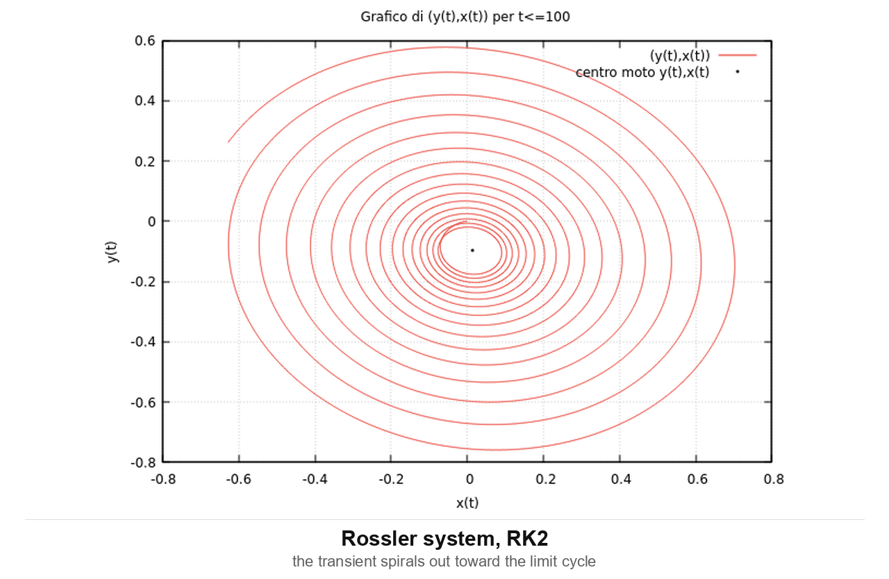

Numerical physics in plain C, from a university lab course. Two independent exercise sets:

1. **The Rössler system** — Runge–Kutta integration, Poincaré sections, period and
   transient measurement, and a period-doubling route to chaos. Written up in full in
   [`report/REPORT.md`](report/REPORT.md).
2. **Stochastic lattice models** — 1-D and 2-D random walks, a biased walk with traps, and
   percolation cluster labelling.

No libraries beyond libc and libm. Plots were produced with gnuplot from the programs'
stdout.

### How this repository came about

The C programs, the figures and the report were written in 2021, for a computational
physics lab course at Sapienza. They then sat untouched for five years.

Bringing them back in 2026 turned out not to be a formality. Code that had run perfectly
on the Linux machine it was written on no longer produced correct results on a current
64-bit Windows toolchain — not because the physics was wrong, but because the ground had
moved underneath it. An integer type that is 64 bits on one system is 32 bits on the
other, and that alone was enough to break the random number generator and put the
diffusion law 30% off. Other programs turned out to have been quietly broken all along,
in ways that never showed up because they never crashed — they just printed wrong
numbers.

So the repository is two things layered on top of each other: the 2021 physics, and a
2026 pass that got it running again, tested it, and wrote down what had to change.
`gas.c` was rewritten from scratch along the way, because its movement logic was wrong in
five independent ways and correcting it line by line would have left a program nobody
could trust.

The `make check` target exists because of this. Rather than asking anyone to take my
word that the code still reproduces the report, it recomputes the numbers and compares
them.

```bash
make          # build everything into bin/
make check    # reproduce the report's headline numbers
```

`make check` verifies eight results against the report and against the physics and exits non-zero on
any mismatch:

```
Rossler system (a=0.1, b=0.1, c=1, x0=y0=z0=0)
  PASS  x,y,z at t=100 (dt=0.01)           -0.7866364173 0.3313694622 0.0901477239
  PASS  transient duration of the system   234.11
  PASS  period averaged over x,y,z         5.84817
  PASS  corr: x with itself at lag 0       1.000000

Random walks (diffusion law <x^2> = t)
  PASS  1D <x^2>/t at t=500, n=5000        within 6%
  PASS  2D <r^2>/t at t=1e5, n=400         within 15%

Lattice gas (32x32, hard-core exclusion)
  PASS  particle count over 20000 moves    conserved
  PASS  acceptance at density 0.6          tracks 1-density
```

---

## 1. The Rössler system

$$
x' = -y - z, \qquad y' = x + a\,y, \qquad z' = b + (x - c)\,z
$$

With `a = b = 0.1` this has a single control parameter `c`, and it goes from a clean
periodic orbit to chaos as `c` grows. The exercise walks that transition.

| Program | What it does |
|---|---|
| `integratore.c` | RK2 integrator. All parameters from the command line. |
| `periodo.c` | Period of each variable, from the spacing of successive maxima. |
| `duratatransiente.c` | Transient duration: when neighbouring maxima stop differing by more than 0.0005. |
| `corr.c` | Normalised cross-correlations between `x`, `y` and `z` against a shifting lag. The lag of strongest correlation is the phase difference. |
| `ex1.c` | Bifurcation diagram. RK4, with linear interpolation to locate the `y(t) = 0` crossings. |
| `ex2.c` | Arc length of the trajectory over the transient, as a function of `c`. RK4. |

### Results

| Quantity | Value |
|---|---|
| `x, y, z` at `t = 100` (`dt = 0.01`) | `-0.7866364173`, `0.3313694622`, `0.0901477239` |
| Period of the stationary orbit | `5.84817` (identical for all three variables) |
| Transient duration | `t_x = 233.12`, `t_y = 217.12`, `t_z = 234.11` → system `234.11` |
| Stationary for | `c ∈ [2 : 5]`; first self-intersection at `c = 6` |
| Bifurcation cascade | `c ∈ [5 : 9.5]` |

The Poincaré sections collapse onto line segments, which is what says the orbit is a
stable limit cycle rather than a chaotic attractor. All three periods come out equal, so
their ratios are rational and the system is genuinely periodic.

The convergence study is the part worth reading: at `dt = 0.1` RK2 gives
`x(100) = 2.869`, at `dt = 10⁻⁵` it gives `-0.6118`. The `dt = 0.01` value used throughout
the rest of the report is still ~28% off the converged one. The squared distance from the
orbit centre behaves much better — `0.5136` at `dt = 10⁻⁵` versus `0.8219` at `dt = 0.01` —
because it is a property of the orbit rather than of the phase along it.

`corr.c` measures the phase differences between the three variables, by correlating each
pair against a shifting lag and taking the lag of strongest correlation:

| pair | lag | correlation |
|---|---|---|
| x–y | 1.54 time units | 0.989 |
| x–z | 0.97 | 0.912 |
| y–z | 5.28 | 0.918 |

The x–y lag is close to a quarter of the 5.85 period, which is what the equations predict:
`y' = x + a·y` makes `y` trail `x` by roughly 90 degrees.

One caveat on those numbers. The correlations are normalised the textbook way, dividing by
the two standard deviations, so a signal against itself at zero lag gives exactly 1 and
every pair is on the same scale — `make check` asserts that. The 2021 version divided by
hand-tuned constants instead, which gave curves of the right shape but an arbitrary
height, so the y-axis here does not match the y-axis of the figures in report section 1.3.
The shapes and the peak positions do.

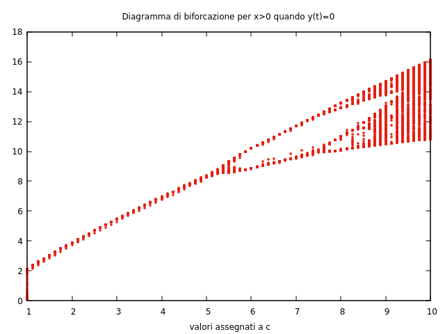

*Bifurcation diagram: `x > 0` sampled whenever `y(t) = 0`, against `c`. The period-doubling
cascade is visible from `c ≈ 5.5`.*

### Running

```bash
./bin/integratore 0.1 0.1 1 0 0 0 0.01 100 > rossler.dat
gnuplot -e "plot 'rossler.dat' u 1:2 w l, '' u 1:3 w l, '' u 1:4 w l; pause -1"

./bin/periodo             # ~20M steps at dt=1e-4, takes a minute
./bin/duratatransiente
./bin/ex1  > bifurcation.dat     # columns: c, x
./bin/ex2  > length.dat          # columns: c, L_r, t_transient
```

`integratore` takes all eight parameters; the other four have the report's parameters
compiled in, since each was written for one specific figure.

---

## 2. Stochastic lattice models

| Program | Arguments | What it does |
|---|---|---|
| `rw.c` | `n_walks t_max [seed]` | 1-D random walk. Prints `t, x, σ_x, x², σ_x², √t` per step. |
| `rw2d.c` | `n_walks t_max [seed]` | 2-D walk on a square lattice. Prints `t, x, y, P(x), P(y), P(x,y)` at `t = 10⁵`. |
| `ale.c` | `n_walks t_max seed` | Biased 1-D walk with traps at `x = ±25, ±51, ±52, ±100`. |
| `per.c` | `L p [seed]` | Percolation on an `L × L` torus, `p` = fraction of broken links. Relaxation labelling until no cluster label changes. |
| `gas.c` | `[L] [density] [steps] [seed]` | Lattice gas on an `L × L` torus with hard-core exclusion. Prints the mean squared displacement per sweep. |

Each program writes one blank-line-separated block per trajectory, which is the format
gnuplot's `index` wants.

### What the figures show

| Figure | |
|---|---|
| 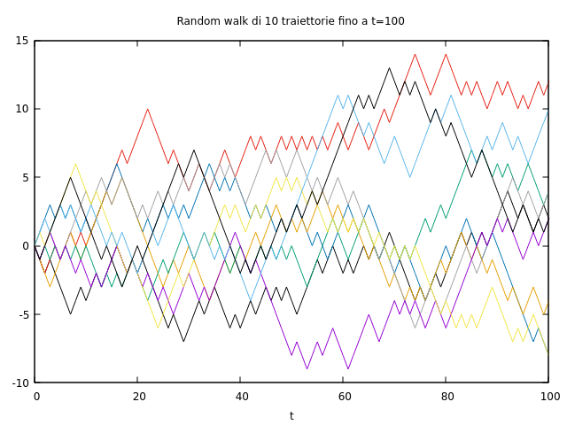 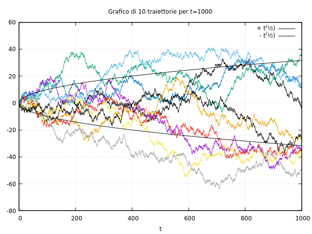 | 10 trajectories to `t = 10²` and `t = 10³`, with the `±√t` envelope. |
| 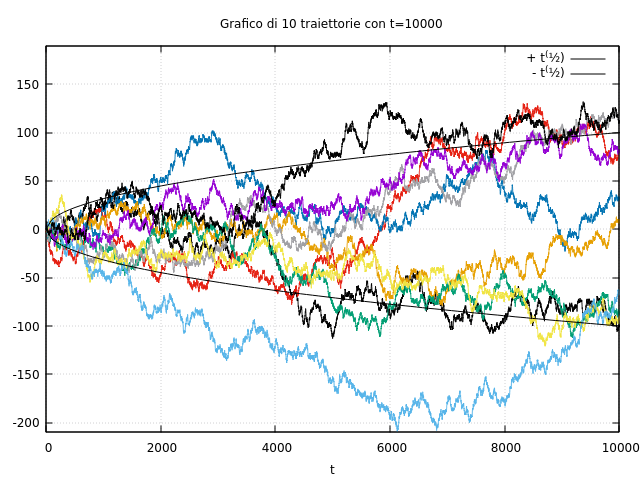 | The same to `t = 10⁴`. Most trajectories stay inside `±√t`; excursions well past it are expected and visible. |
| 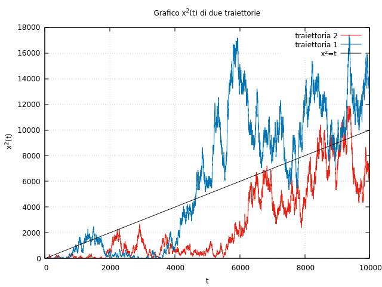 | `x²(t)` for two single trajectories against the line `x² = t`. A single walk fluctuates wildly around it — the diffusion law is a statement about the ensemble mean, not about any one walk. |
| 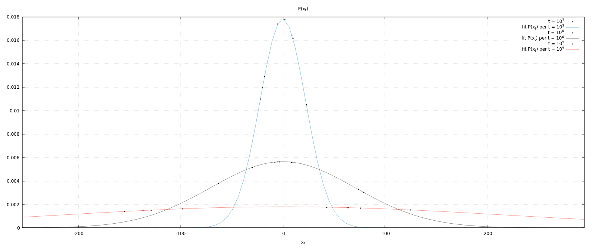 | `P(x_t)` at `t = 10³, 10⁴, 10⁵` with Gaussian fits. The distribution flattens and widens as `√t`. |
| 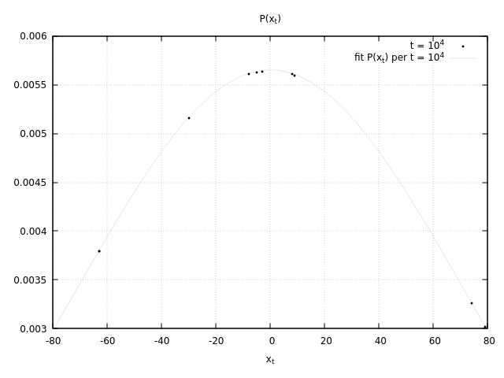 | The `t = 10⁴` curve alone. |
| 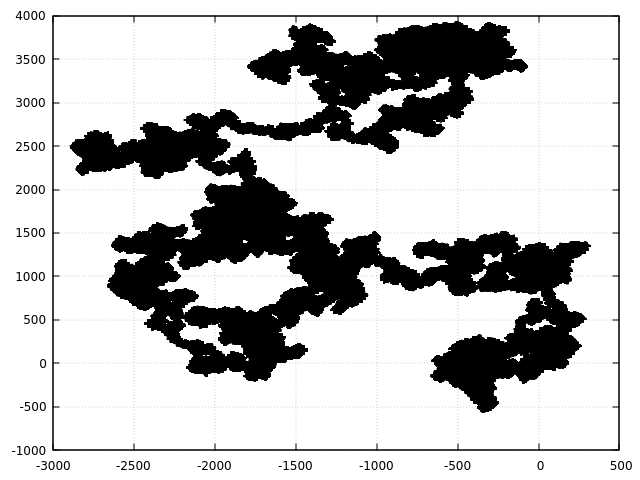 | A single 2-D walk. The fractal, clustered structure is characteristic — the walk revisits neighbourhoods many times before escaping. |
| 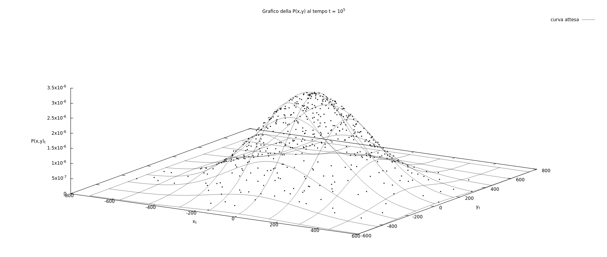 | `P(x, y)` at `t = 10⁵` against the expected 2-D Gaussian surface. |
| 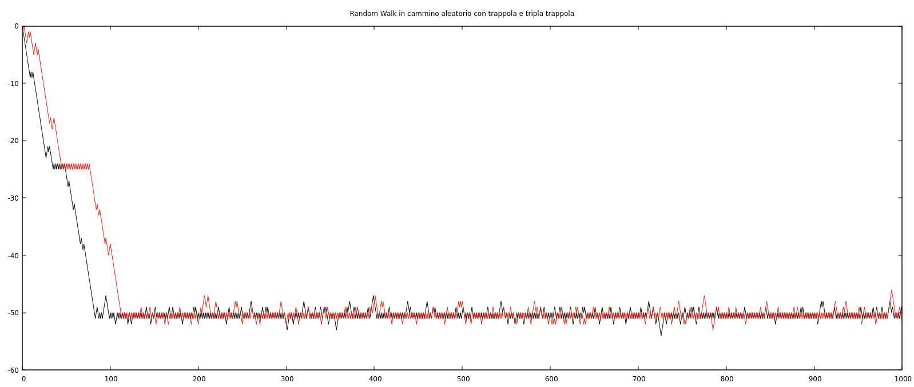 | The biased walk with traps. Two trajectories descend, stall at `x = -25`, then settle around `-50`/`-51`. |

The trap mechanism: a bias `p` is drawn once at the start, and each step goes up with
probability `1 - p`. On the trap sites the rule switches to "step up with probability 0.9",
which pushes the walk back toward the origin. When the drift is downward, the walk gets
caught for long stretches at the traps it meets. Reproduce that figure with

```bash
./bin/ale 1 1000 180        # seed 180 gives p = 0.951, a strong downward drift
```

Seeds giving small `p` produce an upward drift that passes straight through the traps
instead, which is the same code doing the same thing.

### The lattice gas

`gas.c` fills an `L × L` torus to a given density and then repeatedly picks a particle at
random and tries to move it to a neighbouring site. The move succeeds only if that site is
empty — no two particles ever share a site. That single rule is the whole model, and it is
enough to produce the behaviour worth measuring: at low density particles barely notice
each other, at high density they jam.

```bash
./bin/gas 32 0.6 20000 4242
```

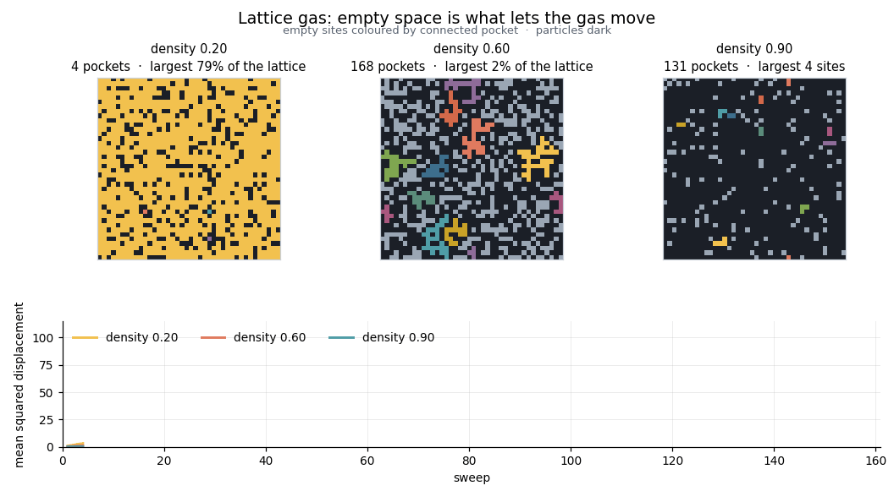

*One run, animated by `scripts/animate.py gas`. Empty sites are coloured by which
connected pocket of empty space they belong to, wrapping across the periodic boundary;
particles are dark.*

That colouring is where this model meets the percolation program next door. A particle can
only step into an empty neighbour, so how far the gas can rearrange is set by the shape of
the empty space rather than by the particles themselves. At density 0.20 the empty sites
form a single network covering 79% of the lattice and the gas moves freely through it. At
0.90 they are 121 isolated pockets, the largest five sites across, and the mean squared
displacement flattens out — from 110 down to 7 over the same number of sweeps.

The threshold sits near a gas density of 0.407, which is where the empty sites stop
percolating on a 2D square lattice. Above it the gas still rearranges, because the
particles move too; if instead the occupied sites were frozen obstacles, transport would
stop dead.


*`scripts/animate.py gas --compare` puts three densities side by side. Same seed, same
number of sweeps; only the density changes.*

### Percolation, animated

The other half of the same picture. `per.c` starts with every site carrying its own label
and sweeps the lattice until neighbours of the same kind agree, so the clusters assemble
themselves out of noise.

```bash
./bin/per 24 0.45 2024
python scripts/animate.py per --L 24 --p 0.45
```

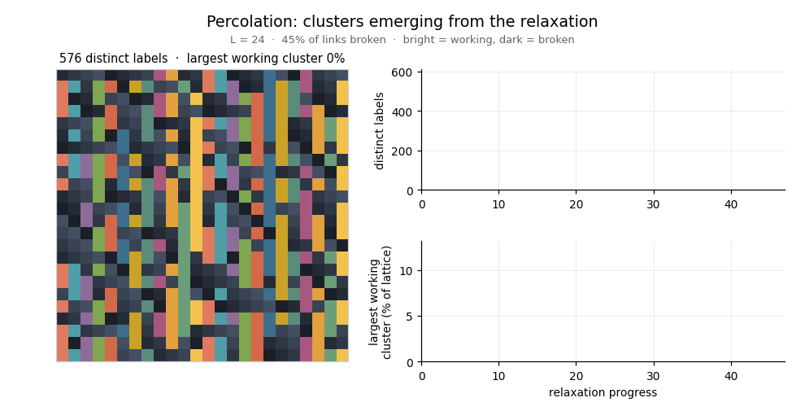

*Bright is a working link, dark is a broken one, and one colour is one cluster. The run
above starts with 576 separate labels — one per site — and settles at 147 clusters, the
largest working one covering 11% of the lattice.*

Watching the two animations together is the point. `per.c` shows how connected regions
form on a lattice; `gas.c` shows what that connectivity does to anything trying to move
through it.

Because a move needs an empty target, the fraction of accepted moves tracks the fraction of
empty sites:

| density | accepted | MSD after the run |
|---|---|---|
| 0.05 | 94.6% | 3479.3 |
| 0.30 | 68.3% | 333.4 |
| 0.60 | 39.5% | 86.8 |
| 0.90 | 11.1% | 13.5 |
| 0.98 | 2.3% | 2.6 |

Displacement is accumulated on unwrapped coordinates: when a particle crosses the periodic
boundary its unwrapped position keeps counting, otherwise a wrap would register as a large
jump backwards and the mean squared displacement would be meaningless.

---

## Porting notes

This was written in 2021 against Linux and glibc, on a machine where `unsigned long` is
64 bits. Running it on a current 64-bit Windows toolchain surfaced the differences below.
Most are portability issues that were invisible on the original hardware — the kind that
only appear once code moves — and they are recorded here so the diff between what the
report describes and what the repository builds is never a mystery.

**A 32-bit integer where a 64-bit one was assumed**

- `unsigned long int seme` → `unsigned long long`. `unsigned long` is 32-bit on Windows
  (LLP64), so `16807 * seme` and `22695477 * seme` overflowed and the linear congruential
  generator degenerated. On the 64-bit Linux `unsigned long` this code was written against,
  it worked.

**Seeding and arguments**

- `seme` was never initialised in `rw.c`, `rw2d.c`, `per.c`. It read whatever was on the
  stack. With a zero-filled stack the generator sticks at 0 and the walk marches in one
  direction forever. It now defaults to `12345` and takes an optional seed argument.
- `rw.c`, `rw2d.c`, `ale.c` and `integratore.c` called `atof(argv[n])` *before* checking
  `argc`, so running them with no arguments dereferenced a null pointer. The check now
  comes first, and prints a usage line.
- The `argv[argc] != NULL` half of the old argument check was always false and did nothing.

**Random number generation**

- Every draw did `seme = (a*seme) % m; srand(seme); r = rand()/RAND_MAX;`. Re-seeding the C
  library generator on every draw makes consecutive draws strongly correlated, because
  `rand()`'s first output is close to linear in its seed on several C libraries. Measured
  effect: `⟨x²⟩` came out ~30% below `t`. The `srand`/`rand` round-trip is gone and the LCG
  value is used directly, which is what the LCG was there for. `⟨x²⟩/t` is now within 2%
  over `t ∈ [50, 500]` at 5000 walks.

**Out-of-bounds access**

- `per.c` segfaulted on every run. The left-neighbour branch had been copy-pasted from the
  upper-neighbour branch and not adapted: it tested `l[i][L-1]` and assigned `l[i-1][j]`,
  reading `l[-1][j]` whenever `i == 0`. The other three branches make the intent
  unambiguous, so it now tests and assigns `l[i][j-1]`.

**Two programs rewritten rather than patched**

- `corr.c` reported a period of `0.01`, which is just `dt`. Its maximum test was
  `x < x_next && x > x_prev` — that is "rising", not "at a peak", so it fired on
  consecutive steps. It also printed from inside its accumulation loop, emitting a running
  partial sum per term instead of one row per lag, and indexed up to `10588` into a
  `double[10000]`. Rewritten around the standard normalised cross-correlation.
- `gas.c` had five independent faults in its movement logic, listed in the commit that
  replaced it, and never simulated anything: its main loop was
  `do {...} while (t > Tmax)` with `t` starting at zero, so it ran a single step.

**Stray debug output**

- `ale.c` printed each raw random number to stdout, interleaving it with the data columns.
- `per.c` printed a per-cell trace inside the relaxation sweep.

Italian user-facing strings were translated to English. Comments in the source are
unchanged.

---

## Layout

```
src/rossler/       RK2 and RK4 programs for the Rössler system
src/stochastic/    random walks and percolation
scripts/check.sh       reproduces the report's headline numbers
scripts/animate.py     builds the GIFs in figures/ (the only Python here)
figures/           gnuplot output for the stochastic models
report/REPORT.md   the Rössler report, in English
report/relazione_IT.pdf   the original Italian report
report/figures/    figures extracted from the PDF, named by page
```

## Requirements

The physics needs nothing but a C99 compiler and `make` — no libraries beyond libc and
libm. `make` and `make check` work with that alone.

The single Python script, `scripts/animate.py`, builds the GIFs and is the only
reason `requirements.txt` exists:

```bash
pip install -r requirements.txt
```

which is `numpy` and `matplotlib`. gnuplot reproduces the static figures in `figures/`,
but the committed ones are already there.

## License

MIT — see [LICENSE](LICENSE).
