# Computational physics — the Rössler system

Giorgio De Santis · 12 November 2021

English translation of `relazione_IT.pdf`. The text follows the original section by
section; the figures are the original ones, extracted from the PDF and named by the page
they appear on.

---

## Part 0 — the integrator

`integratore.c` implements the second-order Runge–Kutta method. The system integrated is

$$
\begin{cases}
x'(t) = -y(t) - z(t) \\
y'(t) = x(t) + a\,y(t) \\
z'(t) = b + \bigl(x(t) - c\bigr)\,z(t)
\end{cases}
$$

The variables `kx1, kx2, ky1, ky2, kz1, kz2` hold the increments of the corresponding
system variables; they are what produce the values at the next index,
`xs = x(n+1)`, `ys = y(n+1)`, `zs = z(n+1)`.

Initial conditions, parameters, step size and maximum integration time are all read from
the command line. A check on the number of supplied values runs before the algorithm.
The integrated variables are written with 10 significant digits.

```
./bin/integratore a b c x0 y0 z0 dt T
```

---

## Part 1

### 1.1 — Integration to t = 100

With `a = 0.1`, `b = 0.1`, `c = 1`, `x0 = y0 = z0 = 0`, `dt = 0.01`, `T = 100`, the values
at `Tmax = 100` are:

| t_max | x(t=100) | y(t=100) | z(t=100) |
|---|---|---|---|
| 100.00 | -0.7866364173 | 0.3313694622 | 0.0901477239 |

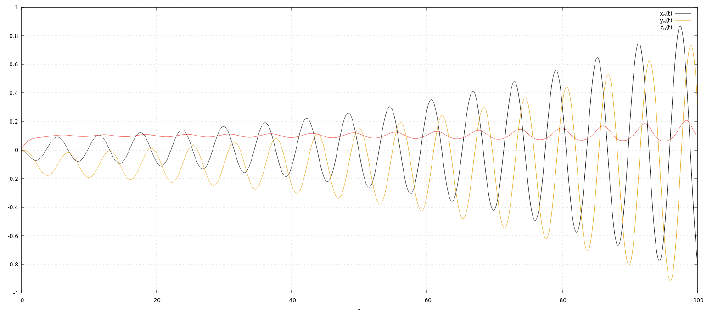

The plot shows `x(t)`, `y(t)`, `z(t)` from the integration. The values in the table at the
final instant match those at `t = 100` exactly.

### 1.2 — Long integration times

To study the system for large `Tmax`, the same code was rerun with `Tmax1 = 2000` and
`Tmax2 = 10000`.

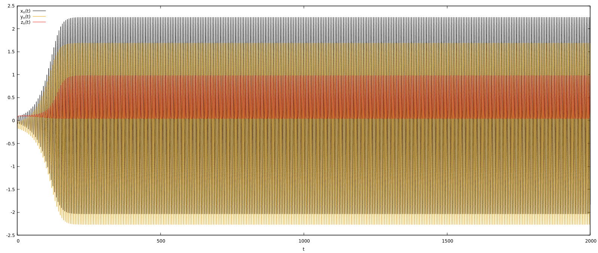

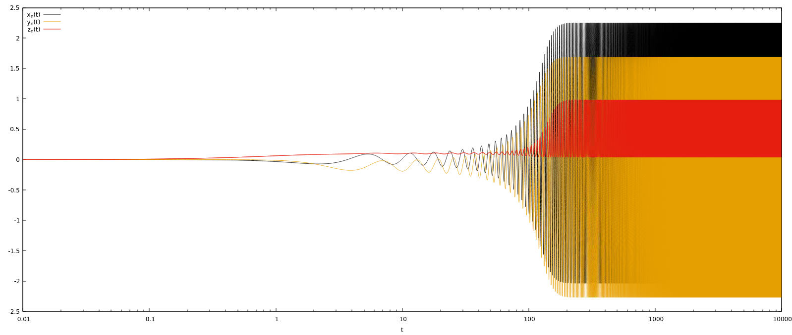

The functions are well approximated by sinusoids. The first plot covers integration up to
2000 on a linear scale; the second covers integration up to 10000. Colour coding: `x(t)`
black, `y(t)` orange, `z(t)` red.

Two regimes are clearly present: a transient one and a stationary one. The transient lasts
roughly **150–300 time units**. For larger `t` the behaviour can be considered stationary:
integrating to 10000 shows no instability by eye for `t < 300`, and integrating for very
long times never produces a second transient. So there are exactly two regimes.

### 1.3 — The stationary regime

The stationary regime was studied mainly with **Poincaré sections**, which are a way of
establishing whether the system is stable or unstable. The plots below show the
derivatives of `x(t)`, `y(t)`, `z(t)` against the variables themselves, sampled once per
period. Parameters and initial conditions are the same as in 1.1 and 1.2, and the
derivatives are computed from the relations in the system.

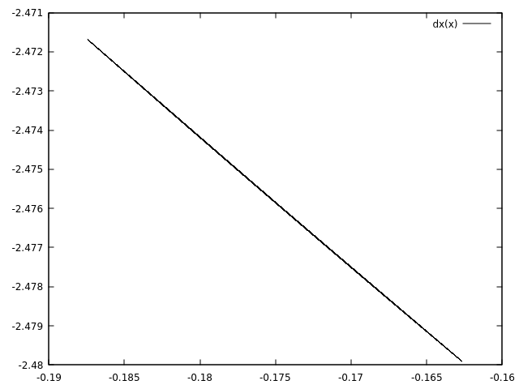

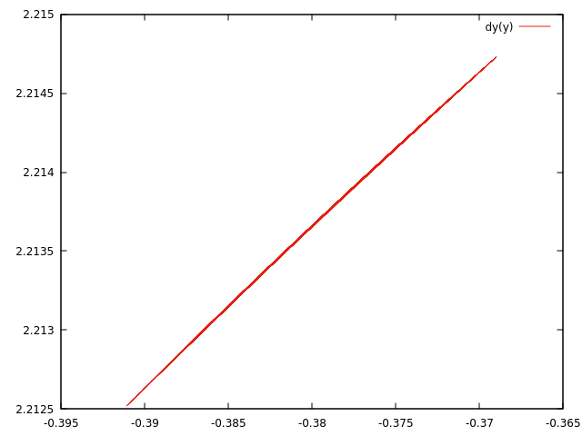

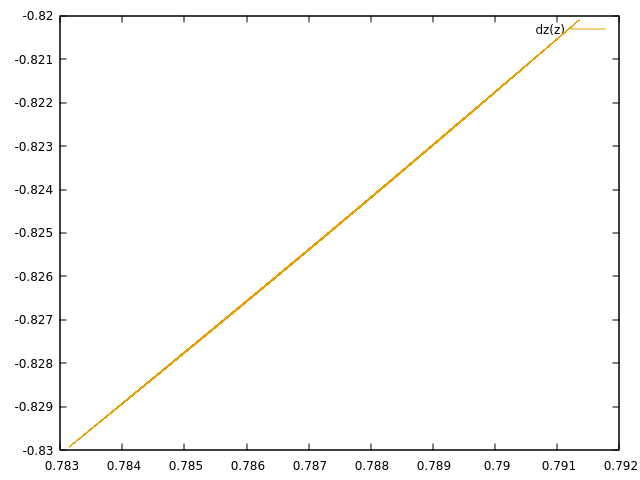

The sections are `(x'(t), x(t))` [black], `(y'(t), y(t))` [red], `(z'(t), z(t))` [orange]
in the stationary regime. The trajectories are not chaotic, therefore stable, for `t`
between 300 and 2000. The behaviour for `t > 300` can be called stationary.

**Period.** Whether the system is periodic — and if so with what period — was determined
with `periodo.c`, which returns the period of each variable. Its output also lists the
intermediate steps, including the sampled times at each maximum of the variables.

The main result is that all three periods are *equal*, within the limits of the
computation, and each equals the period of the system:

$$T = 5.84817$$

A system can be considered periodic if the ratios between the periods of its component
functions are rational. Here the ratios are unity, so the system is periodic.

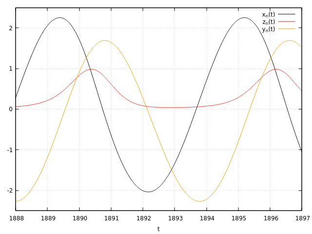

**Cross-correlation.** Finally, how the functions resulting from the integration of the
discrete values correlate with each other. `corr.c` computes the cross-correlations
between `x`, `y`, `z` using

$$
\mathrm{Corr}_{x-y} = \int_{t}^{t+T} x(t)\,y(t+k)\;dt
\qquad
\mathrm{Corr}_{x-z} = \int_{t}^{t+T} x(t)\,z(t+k)\;dt
$$

The integrals are taken over one period in the stationary regime. Since the points are
discrete, this is a sum of products; the normalisation is applied afterwards.

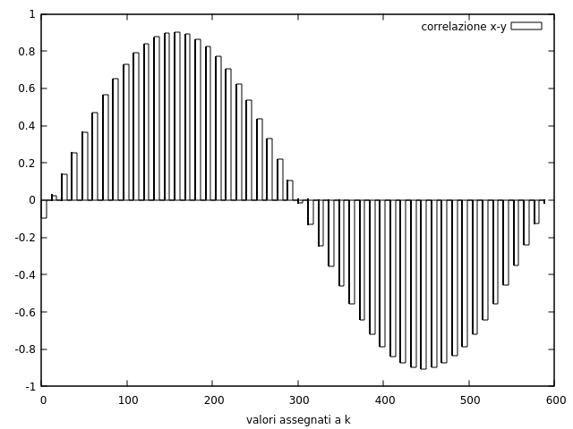

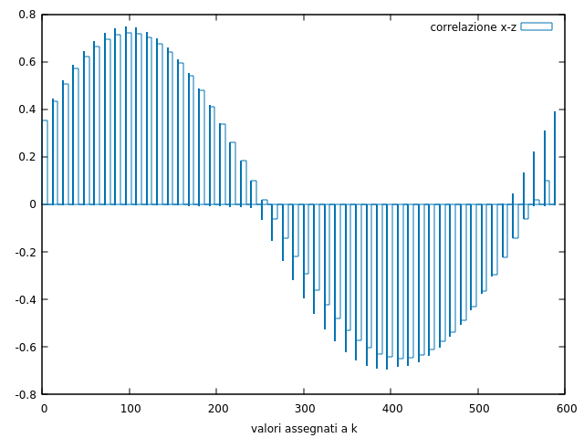

The maximum correlation occurs at an offset `k` which is exactly the phase difference
between the sinusoid-like functions obtained in the stationary regime. This can be checked
against the output of `periodo.c`, which returns two maxima of each variable separated in
time by `t_φ`. `k` is measured in integration steps; its maximum value here is 600. Since
`dt = 0.01` in this integration, `k = t · 100`.

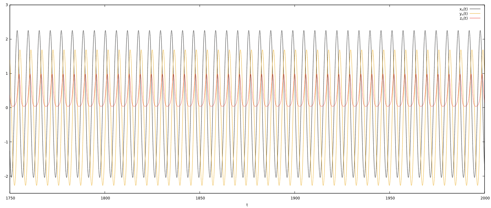

### 1.4 — Duration of the transient

The transient was estimated above as `t_transient ∈ [150 : 300]`. `duratatransiente.c`
pins it down: it runs Runge–Kutta and finds the time at which the difference between two
neighbouring maxima of each variable becomes negligible (`< 0.0005`), then takes the
maximum of the three durations to get the transient of the whole system.

The measurement depends on the negligibility threshold — the smaller the difference
required, the longer the transient. `0.0005` is 5% of `dt`, and the resulting value is
consistent with what the curves show by eye.

Program output:

```
transient duration per variable:
tx = 233.120000,
ty = 217.120000,
tz = 234.110000.
transient duration of the system: 234.110000
```

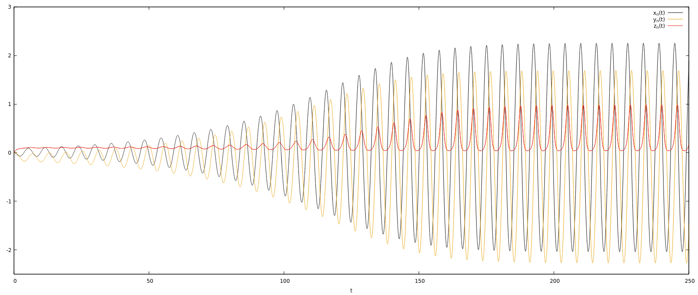

### 1.5 — Error analysis

The table below gives the values at `t = 100` for different integration steps `dt`:

| dt | t | x(t) | y(t) | z(t) |
|---|---|---|---|---|
| 0.100000 | 100 | 2.8694253792 | -2.1561496295 | 0.2311922254 |
| 0.010000 | 100 | -0.7866364173 | 0.3313694622 | 0.0901477239 |
| 0.001000 | 100 | -0.6273294567 | 0.2626370336 | 0.0917115438 |
| 0.000100 | 100 | -0.6132361981 | 0.2557639998 | 0.0918446793 |
| 0.000010 | 100 | -0.6118438592 | 0.2550786639 | 0.0918578306 |

The second row is the one already shown in 1.1.

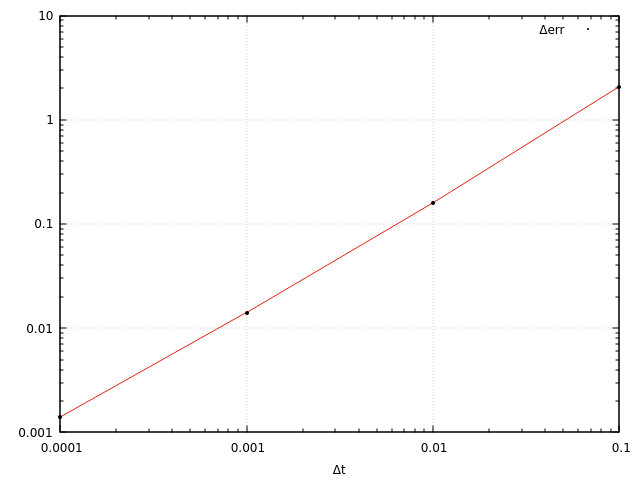

The plot shows the difference `x(dt_n) - x(dt_n+1)` as a function of `dt`. Both axes are
logarithmic, since each `dt` is one tenth of the previous one and the differences are
easier to appreciate that way than on a linear scale.

**Distance from the central point.** Once stationary, `x(t)`, `y(t)`, `z(t)` are stable
around a point from which the distance stays constant. This can be examined at a single
instant, as a function of `dt`. In the `(x, y)` plot below for `t ≤ 100` the motion turns
around the indicated centre, though it still diverges because the stationary phase has not
been reached. The centre is the mean of all `x` and `y` components up to `t = 100`.

| x_centre | y_centre |
|---|---|
| 0.012326 | -0.097039 |

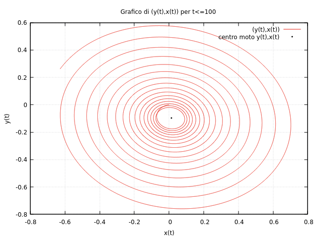

With `x_centre`, `y_centre` the coordinates of that centre,

$$
R_{C-(x,y)} = \sqrt{(x_\text{centre}-x)^2 + (y_\text{centre}-y)^2}
\qquad
R^2_{C-(x,y)} = (x_\text{centre}-x)^2 + (y_\text{centre}-y)^2
$$

| dt | squared distance from the centre (x,y) |
|---|---|
| 0.00001 | 0.513575 |
| 0.0001 | 0.515798 |
| 0.001 | 0.538526 |
| 0.01 | 0.821875 |
| 0.1 | 12.402953 |

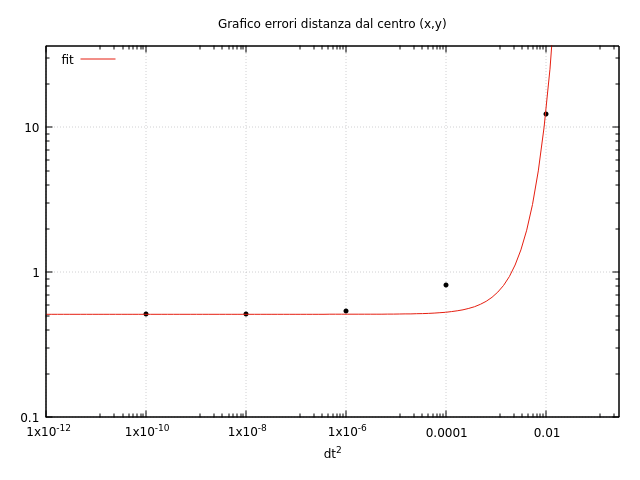

### 1.6 — Dynamics as a function of c

The first part closes with the dynamics for different values of `c`, varied over
`c ∈ [2 : 10]`. Each plot shows the `(x, y)` plane, each adding one more curve at
`c_(n+1) = c + 1`.

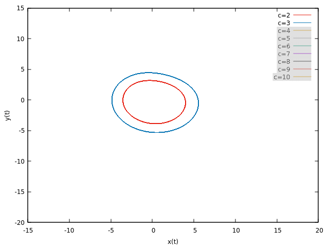

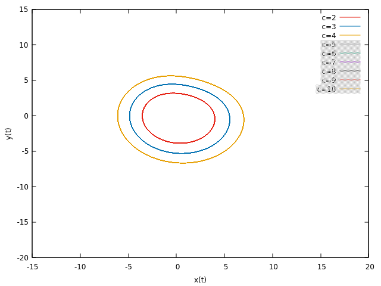

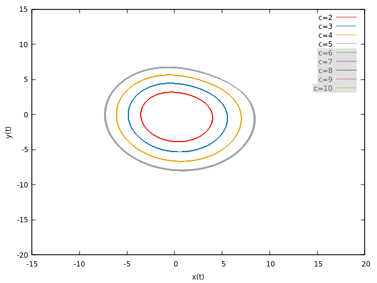

In the first three plots the stability of the regime is clear. They show `(x(t), y(t))`
with `c = 2, 3` in the first, `c = 4` added in the second, `c = 5` in the third. For
`c ∈ [2 : 5]` the system is stationary.

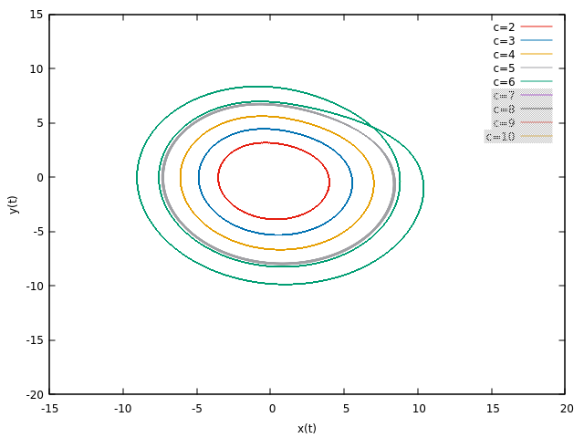

The fourth plot adds `c = 6`, in green. It is the first that differs from the others. The
curves for `c ≤ 5` are well approximated by a closed oval; at `c = 6` the curve overlaps
itself at one point in time and the trajectory is no longer as stable. The same holds for
`c > 6`.

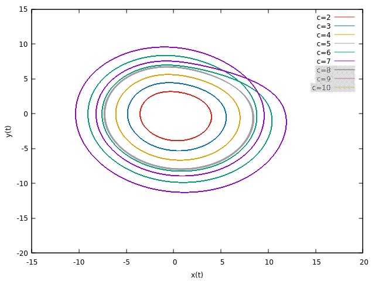

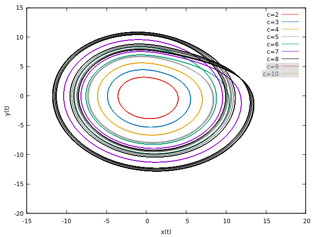

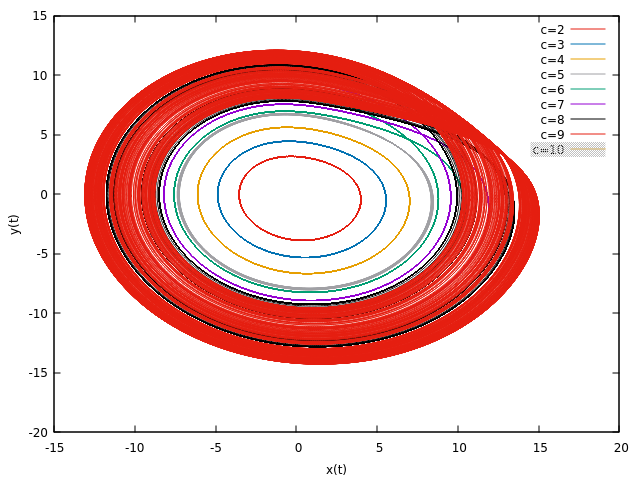

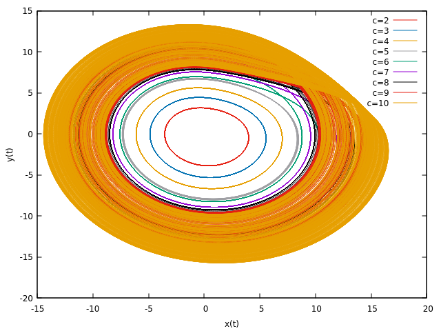

The last four plots add trajectories for `c ∈ [6 : 10]`. As `c → 10` the trajectories
become steadily less stable and bend more and more toward the origin.

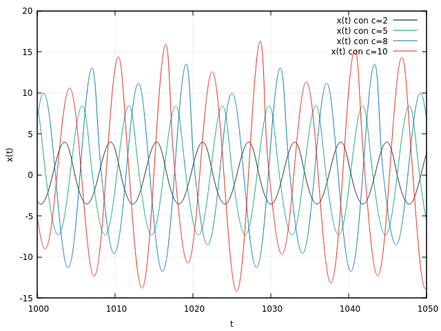

This plot shows the integrated `x(t)` against time for `c = 2, 5, 8, 10`. The maxima are
the interesting part. At `c = 2` the amplitude of the sinusoid is constant, so — being in
the stationary regime — the maxima and minima have constant values. For `c = 5, 8, 10` they
do not, and the spread between successive maxima grows as `c → 10`.

---

## Part 2 — extra

This part uses the **fourth-order** Runge–Kutta algorithm.

### 2.1 — Bifurcation diagram

`ex1.c` produces the bifurcation diagram. After the fourth-order integration step there
are two checks: one for `y(t) = 0` and one for `x(t) = 0`.

Working with discrete values, the times at which `y(t) = 0` are found by linear
interpolation between step `n` and step `n+1`. On these time scales linear interpolation
is reliable. Those times are then used to find the values `x(t) > 0` between `x_n` and
`x_(n+1)`. In formulae, for `(y_n, t)` and `(y_(n+1), t+dt)` with `y_n · y_(n+1) < 0`:

$$
m_y = \frac{y_{n+1}-y_n}{dt}, \qquad q_y = y_n - m_y t
$$

so `y = m_y t + q_y` is the line through `(y_n, t)` and `(y_(n+1), t+dt)`. Imposing
`y(t) = 0`:

$$
t_{y0} = -\frac{q_y}{m_y}
$$

which is the time at which `y(t) = 0`. Writing the line through `(x_n, t)` and
`(x_(n+1), t+dt)` the same way,

$$
m_x = \frac{x_{n+1}-x_n}{dt}, \qquad q_x = x_n - m_x t, \qquad x = m_x t + q_x
$$

and substituting `t_y0`:

$$
x(t_{y0}) = m_x\,t_{y0} + q_x
$$

The bifurcation diagram plots these `x(t_y0)` values, over `c ∈ [1 : 10]`.


The system becomes progressively more chaotic as `c → 10`. As already established, for
`c ∈ [0 : 5]` there is no instability. The transition between the two states is the
bifurcation visible over `c ∈ [5 : 9.5]`.

### 2.2 — Length of the transient

`ex2.c` applies fourth-order Runge–Kutta twice: once to find the transient duration for
each `c ∈ [0.4 : 1]`, and once to compute the integral of the length of the system between
`t0 = 0` and `t_transient(c)`. The output is ordered `(c, L_r(t), t_transient)`.

To unify the lengths, `x(t)`, `y(t)`, `z(t)` are treated as the projections of a vector
`r(t)` with modulus

$$|\vec r(t)| = \sqrt{x(t)^2 + y(t)^2 + z(t)^2}$$

so that `dr(t)/dt = r'(t)` with modulus
`|r'(t)| = sqrt(x'(t)² + y'(t)² + z'(t)²)`. For a curve `r(t)` — here in three dimensions —
the length is

$$
L_{r(t)} = \int_{0}^{t_\text{transient}} \lVert r'(t)\rVert \, dt
         = \int_{0}^{t_\text{transient}} \sqrt{x'(t)^2 + y'(t)^2 + z'(t)^2}\; dt
$$

and, substituting the derivatives from the system,

$$
L_{r(t)} = \int_{0}^{t_\text{transient}}
\sqrt{\bigl(-y(t)-z(t)\bigr)^2 + \bigl(x(t)+0.1\,y(t)\bigr)^2 + \bigl(0.1 + (x(t)-c)z(t)\bigr)^2}\; dt
$$

From the program output the transients in the third column decrease, down to a value very
close to the transient computed at `c = 1`.

The lengths are less immediately readable: observed over intervals that are not long
enough, no overall trend emerges. That non-linearity is explained by there being three
contributions to the transient length, and by the curves from `x_n(t)`, `y_n(t)`, `z_n(t)`
having different amplitudes at different `c` if sinusoidal. The overall trend is still
clear — the lengths decrease along with the respective transient durations, though more
erratically as `c → 1`. The product of curve length and time is therefore constant for
`c ∈ [0.4 : 1]`.

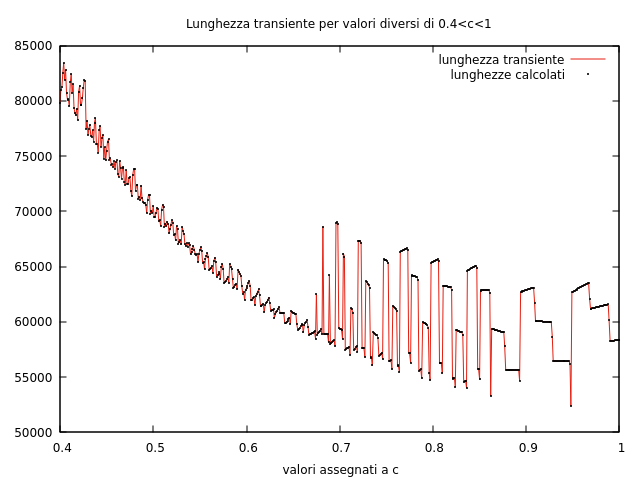

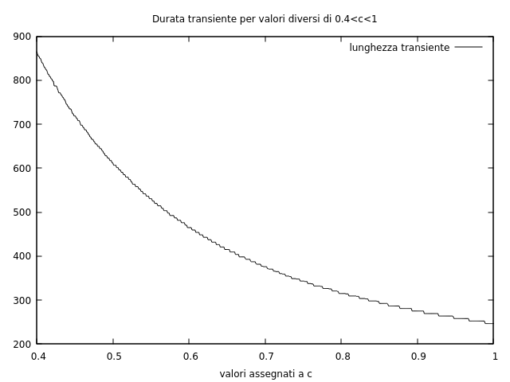

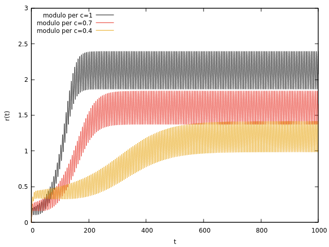

---

## 3 — Closing remarks

The system of differential equations studied here does not, in general, represent a
physical system. If `x(t)`, `y(t)`, `z(t)` are taken as the components of a vector — an
assumption already made above — then with some further specification the system can be
read as one. For instance, treating `r'(t)` as a force vector makes the variables the
components of that force:

$$\vec r\,'(t) = x'(t)\,\hat\imath + y'(t)\,\hat\jmath + z'(t)\,\hat k$$

$$\vec F = f_x(t)\,\hat\imath + f_y(t)\,\hat\jmath + f_z(t)\,\hat k$$

Integrating the equations relating the force components gives the velocity vector:

$$\vec v = v_x(t)\,\hat\imath + v_y(t)\,\hat\jmath + v_z(t)\,\hat k$$

Plotting the results in three dimensions under that reading, the first plot is the
velocity — the result of the integration — and the second is its derivative, the
acceleration.

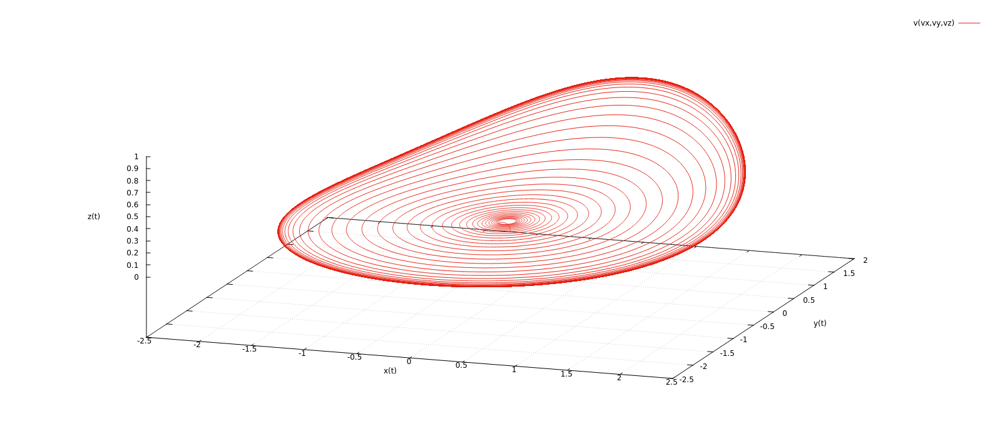

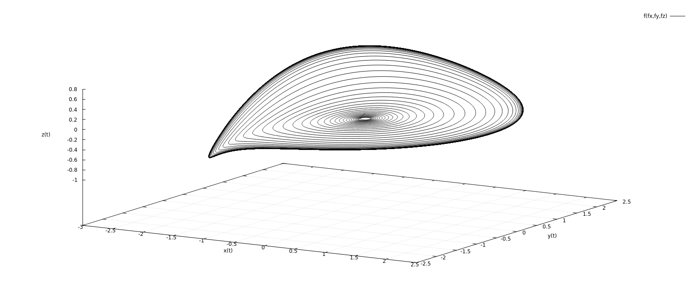
